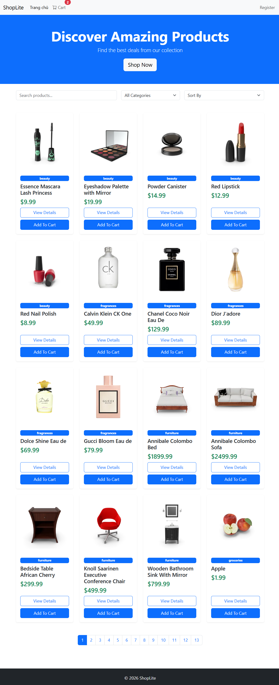
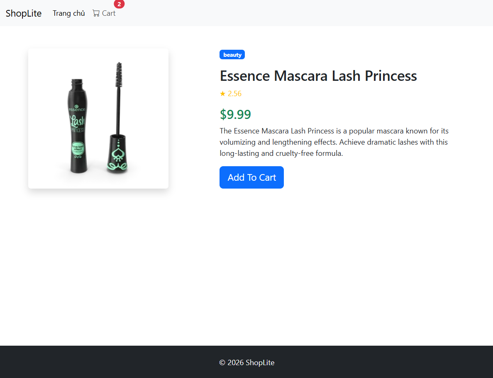
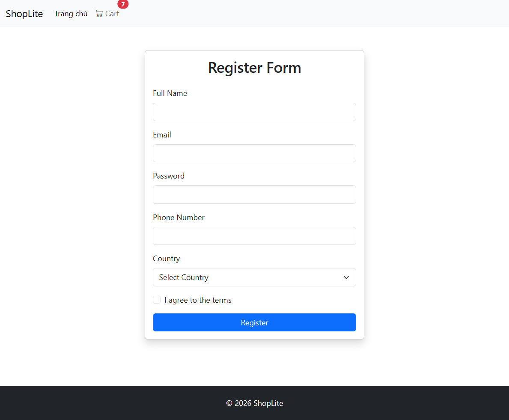

**folder structure:**

```
fef-shoplite-DuongNKT/
├── index.html          # Homepage: Danh sách sản phẩm
├── product.html        # Detail: Chi tiết 1 sản phẩm
├── cart.html           # Cart: Giở hàng
├── register.html       # Register: Đăng ký
├── css/
│   └── style.css
├── js/
│   ├── api.js          # shared fetch function
│   ├── cart.js         # cart logic + localStorage
│   ├── register.js
│   ├── home.js
│   ├── product.js
│   └── register.js
├── assets/             # images, icons
└── README.md
```

# ShopLite - Mini E-Commerce Project

**Demo Link:** [Github Page](https://inigus-m.github.io/fef-shoplite-DuongNKT/)

## 1. Short Description (Mô tả ngắn gọn)

ShopLite là một ứng dụng web thương mại điện tử đa trang chạy hoàn toàn trên client-side. Dự án sử dụng HTML5, CSS3, Bootstrap 5 và JavaScript để xử lý logic, đồng thời sử dụng Fetch API để gọi dữ liệu sản phẩm thực tế từ [Fake Store API](https://dummyjson.com/products).

## 2. Screenshots (Ảnh chụp màn hình)

_(Gợi ý: Cắt ảnh màn hình các trang web của bạn, lưu vào thư mục dự án và chèn đường dẫn vào đây, hoặc kéo thả trực tiếp ảnh vào giao diện GitHub để lấy link)_

- **Trang chủ (Home):**
  
- **Trang Chi tiết Sản phẩm (Product Detail):**
  
- **Giỏ hàng (Cart):**
  
- **Đăng ký (Register):**
  

## 3. Local Run Instructions

Để chạy dự án này trên máy tính cá nhân (local):

1. Clone kho lưu trữ này về máy: `git clone https://github.com/Inigus-M/fef-shoplite-DuongNKT.git`
2. Mở thư mục dự án bằng phần mềm **Visual Studio Code**.
3. Cài đặt tiện ích mở rộng (extension) **Live Server**.
4. Chuột phải vào file `index.html` và chọn **"Open with Live Server"**. Trang web sẽ tự động mở trên trình duyệt của bạn.

## 4. Completed Features (Các tính năng đã hoàn thành)

_(Đánh dấu `[x]` vào các tính năng bạn đã hoàn thiện)_

### 🟢 Mức Đạt (Pass Tier)

- [x] Xây dựng đủ 4 trang giao diện liên kết qua thanh Navbar chung.
- [x] Viết cấu trúc HTML chuẩn ngữ nghĩa (Semantic HTML) và Responsive cơ bản (không vỡ trên điện thoại).
- [x] Gọi dữ liệu sản phẩm từ API và hiển thị ra DOM trên Trang chủ (không hard-code HTML).
- [x] Trang chi tiết lấy được ID từ URL và hiển thị đúng thông tin của 1 sản phẩm.
- [x] Form đăng ký chặn được submit và hiển thị lỗi thông báo validation bằng JavaScript.

### 🟡 Mức Khá (Good Tier)

- [x] Giỏ hàng hoạt động đầy đủ (thêm, xóa, cập nhật số lượng, tính tổng) và lưu trữ xuyên trang bằng `localStorage`.
- [x] Tính năng tìm kiếm/lọc sản phẩm theo danh mục và cập nhật giao diện lưới tức thì.
- [ ] Có trạng thái hiển thị rõ ràng khi đang tải API (Loading) và khi gặp lỗi (Error).
- [ ] Bố cục giao diện bằng Flexbox/Grid hiển thị mượt mà trên cả 3 kích thước màn hình.

### 🔴 Mức Giỏi (Excellent Tier)

- [ ] Áp dụng kỹ thuật Event Delegation cho danh sách lưới sản phẩm hoặc giỏ hàng.
- [ ] Tính năng sắp xếp (Sort theo giá, tên) kết hợp đồng thời cùng bộ lọc.
- [ ] Có huy hiệu (badge) đếm số lượng giỏ hàng trên Navbar tự động đồng bộ.
- [ ] Tính năng phân trang (Pagination) hoặc Tải thêm (Load more) danh sách sản phẩm.
- [ ] Nâng cao trải nghiệm UX: khung tải skeleton, toast notification báo thành công, kỹ thuật debounce cho ô tìm kiếm.
- [ ] Cấu trúc code sạch sẽ (tách hàm/modules rõ ràng, đặt tên chuẩn, không có lỗi đỏ trên Console).
